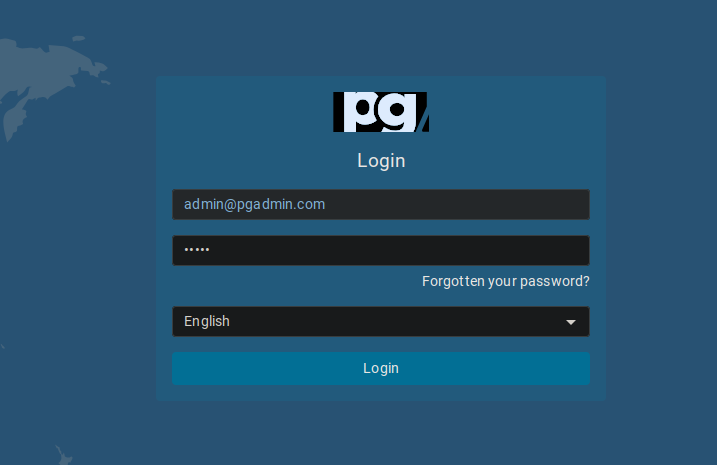
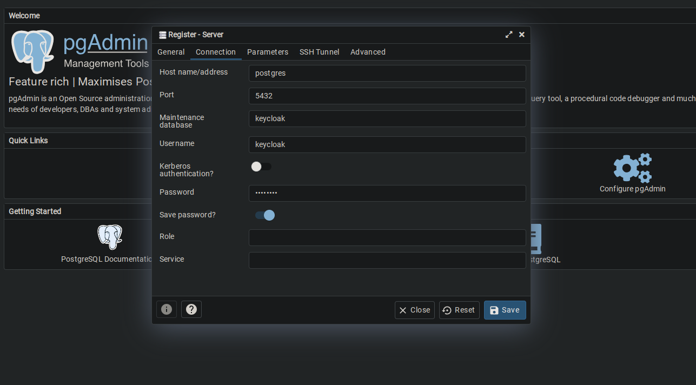

# Auth Server

The auth server is responsible for the IAM (Identity and Access Management).

## Useful links

- [Keycloak](https://www.keycloak.org/)
- [Keycloak Docker Hub](https://hub.docker.com/r/keycloak/keycloak/)
- [Postgres Docker Hub](https://hub.docker.com/_/postgres/)
- [Postgres AWS Deploy](https://aws.amazon.com/getting-started/hands-on/create-connect-postgresql-db/)

## Tech Stack

- Keycloak for IAM
- PostgreSQL as Database
- pgAdmin4 as PostgreSQL administration tool

## Custom Providers

Custom providers are extensions of the original Keycloak feature. For this project, some custom providers will be used.

See more at [server development](https://www.keycloak.org/docs/latest/server_development/).

### External Providers

- [Apple Identity Provider](https://github.com/klausbetz/apple-identity-provider-keycloak)
    - The JAR was extracted from [here](https://github.com/klausbetz/apple-identity-provider-keycloak/releases/tag/1.7.0)

## API Gateway Integration

See more at [Keycloak Authorization with KrakenD API Gateway](https://www.krakend.io/docs/authorization/keycloak/).

## Configuration

- Start by building the server
    ```sh
    docker compose build
    ```
- Add the environment file
    ```sh
    cp .env.example .env
    ```
- Start the server
    ```sh
    docker compose up
    ```
- Give pgAdmin volume right permissions
    ```sh
    sudo chown 5050 ./data/pgadmin
    ```
- Configure Keycloak DB in pgAdmin ([localhost:5050](http://localhost:5050))
    1. Login (defaults: admin@pgadmin.com, admin)

        

    2. Login (defaults: postgres, 5432, keycloak, keycloak, password)

        

    3. You're all set! Start using and configuring Keycloak at [localhost:8080](http://localhost:8080) and [localhost:8081](http://localhost:8081)